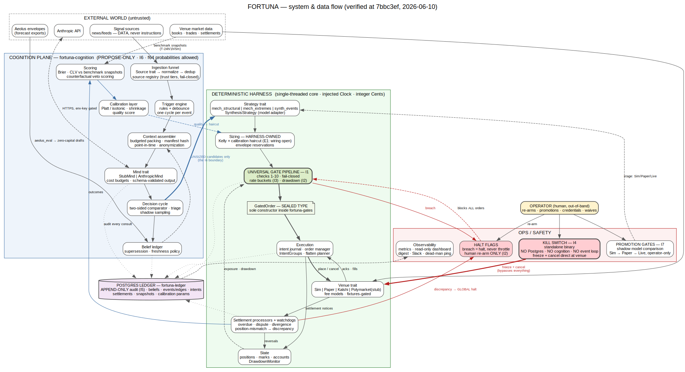

# FORTUNA architecture

**Who this is for:** anyone about to read or change FORTUNA code — a new session,
a new implementer track, or the operator wanting to know why a boundary exists
before bending it. Read this before your first edit; read [spec.md](spec.md)
(v0.9, the normative design) for any detail this doc summarizes. When this doc
and the spec disagree, the spec wins ([CLAUDE.md](../CLAUDE.md)).

**Status honesty:** accurate as of commit `334612d` (main, 2026-06-12). The
system runs Sim-only — the daemon's boot refuses every venue except `"sim"`
([track-c-final-gate, criterion C3](reviews/track-c-final-gate-2026-06-12.md));
the system has never placed an order on a real venue (the only real-venue
traffic in the project's history is read-only data capture and operator-run
fixture recording against demo environments, spec §5.2/§5.15). The Phase-4 EXIT soak was declared GO at
`8ea8a4d` ([soak-go-gate](reviews/soak-go-gate-2026-06-12.md)); the start is an
operator action. The Kalshi adapter is fixtures-gated pending the operator
recording session (BUILD_PLAN T4.2); the Kinetics perps implementation lives on
the `track-c` branch awaiting its re-merge package
([GATE-FINDINGS-LATEST](reviews/GATE-FINDINGS-LATEST.md)).

Companion docs: [README](../README.md) · [quickstart](quickstart.md) ·
[verification](verification.md) · [operations](operations.md) ·
[runbooks/](runbooks/). Ledgers ([BUILD_PLAN](../BUILD_PLAN.md),
[GAPS](../GAPS.md), [ASSUMPTIONS](../ASSUMPTIONS.md)) stay authoritative for
task and gap state — this doc points, never restates.

---

## 1. The system in one diagram

Source: [fortuna-architecture.dot](diagrams/fortuna-architecture.dot) (the
label records its verification point: 7bbc3ef, 2026-06-10; the structure is
unchanged at `334612d` — the synthesis arm and schedulers described in §7
landed inside the boxes it already draws).

How to read it:

- The **dashed cluster at top** is the external world — venue feeds, signal
  sources, Aeolus forecast exports, and the Anthropic API. All of it is
  untrusted. Signal text is "DATA, never instructions" (spec §5.11); the
  Anthropic edge is just another vendor connection, dashed and env-key-gated.
- The **blue cluster** is the cognition plane (`fortuna-cognition`): ingestion
  funnel → trigger engine → context assembler → Mind → decision cycle, with the
  belief ledger, calibration layer, and scoring loop beside it. `f64`
  probabilities are allowed here and only here.
- The **single thick blue arrow** crossing from the decision cycle into the
  Strategy trait is the only crossing between the two planes, and it carries
  **unsized candidates only**. That is the I6 boundary drawn as one line.
- The **green cluster** is the deterministic harness: strategies → sizing →
  the universal gate pipeline (I1) → the sealed `GatedOrder` note → execution →
  venues, with state and the settlement watchdogs feeding back.
- The **red cluster** is ops/safety: halt flags (I2), the kill switch (I4,
  drawn with its own thick red path direct to the venue, bypassing everything),
  promotion gates (I7), and observability. The **operator node** sits outside
  every cluster — re-arms, promotions, credentials, and waives enter from
  out-of-band, by design.
- The **cylinder** is the Postgres ledger; dotted edges into it from the mind,
  gates, execution, settlement, and beliefs are the I5 append-only audit trail.

## 2. The three planes, and why the boundaries sit where they do

The spec's seven invariants (Section 3; quoted verbatim in
[CLAUDE.md](../CLAUDE.md)) are all boundary statements. The architecture is
those statements made structural.

**Cognition plane (propose-only).** Everything probabilistic — context
assembly, the Mind trait, beliefs, calibration, the review loops — lives in
`fortuna-cognition`. The model's output type, `MindOutput`, contains beliefs,
proposals, and journal drafts and nothing executable (spec §5.9). *Why here:*
model output is a vendor product of unverifiable quality and external text is a
prompt-injection surface; the worst a poisoned context or a hallucinating model
can produce is a bad proposal, which still faces the gates, the caps, and the
edge floors (spec §10). Sizing, timing, order type, and execution are
deliberately not the model's to decide (I6, spec §5.9 "Sizing is not the
model's job").

**Deterministic harness.** Strategies, sizing, gates, execution, state, and
venue adapters — everything that touches money — is single-threaded,
clock-injected, replayable Rust (spec Principle 2, §5.1). *Why here:* a halt
decision or a fill application you cannot replay is one you cannot audit (I5),
and the harness is where the durable edge is supposed to live (spec §1 thesis),
so it is the part held to the strictest standard.

**Safety plane.** Halt flags, the kill switch, promotion gates, and
observability sit beside the harness, not inside the cognition plane, and three
of its controls are deliberately *inverted* — they require a human, and the
software is built to be unable to substitute for one:

- **Why propose-only (I6):** the gate pipeline cannot be argued with because it
  never hears an argument — "the model cannot bypass, modify, disable, or be
  consulted by the gates" (I1). Trust in the model is expressed exclusively
  through calibration weight and shadow gating, "never through bankroll" (spec
  §5.14).
- **Why human re-arm, and why re-arm is restart-gated (I2):** a drawdown halt
  exists because the system's model of the world just failed; automatic
  resumption would let the same failed model decide it is fine now. Breach sets
  a flag only a human can clear, and clearing is CLI-only — Slack may request,
  the CLI confirms, because "a compromised Slack token must not be able to
  un-halt a halted system" (spec §8; [fortuna-cli
  main.rs](../crates/fortuna-cli/src/main.rs) header). The running daemon's
  halt poller applies halts within 500ms but deliberately does **not** clear on
  a rearm row; the rearm takes effect at the next boot's halt-state fold. The
  operator adjudicated this as the intended conservative reading of I2 —
  resumption requires a deliberate restart, not a poller noticing a row
  ([operator-decisions-2026-06-12, item 3](reviews/operator-decisions-2026-06-12.md)).
- **Why the kill switch has no Postgres (I4):** it is the control you reach for
  when the stack is the problem, so it may depend on nothing the stack can take
  down with it. `fortuna-killswitch` depends only on `fortuna-core` and
  `fortuna-venues` — no Postgres, no ledger, no cognition runtime, no event
  loop, no Slack — and journals its actions to a local fsync'd flat file so the
  operator can reconstruct what it did even with the audit store dead
  ([killswitch lib.rs](../crates/fortuna-killswitch/src/lib.rs); spec
  Principle 9 exception). Its default action is freeze-and-cancel; emergency
  flatten through it skips the flatten planner's cost estimate as "an accepted
  emergency cost" (spec §5.4). It holds its own credential set (spec §10) and
  its independence is asserted by a test that spawns the real standalone binary
  ([i4_killswitch_independence.rs](../crates/fortuna-invariants/tests/i4_killswitch_independence.rs))
  plus a monthly drill ([scripts/killswitch-test.sh](../scripts/killswitch-test.sh)).
- **Why promotions are operator-only (I7):** forward validation is the only
  validation this system accepts for LLM decisions (spec Principle 4), and the
  thing being validated must not grade itself. The code computes GO/NO-GO
  *recommendations*; promotion is a recorded human action, and the rails
  enforce that a system/blank actor cannot promote
  ([i7_promotion_gates.rs](../crates/fortuna-invariants/tests/i7_promotion_gates.rs)).

The invariants are executable: `crates/fortuna-invariants/` is a protected
crate — additions only, any touch is an automatic gate BLOCK pending operator
waive ([CLAUDE.md](../CLAUDE.md) "Protected directory").

## 3. Crate map

Sixteen crates as of `f31aaa8` (the news-ingestion merge added `fortuna-sources`). Each entry: what it owns, its key types, and
what it must never do. The first line of each crate's `lib.rs` (or `main.rs`)
cites its spec sections; those headers are kept true and are the per-crate
source of record.

**[fortuna-core](../crates/fortuna-core/src/lib.rs)** — the deterministic
foundation (spec §5.1): the `Clock` trait (real + sim), `Cents` (checked
integer-cent money), ULID ids, `BusEvent`, the single-threaded event bus, and
replay record/playback. Determinism rule: identical seed + identical inputs ⇒
byte-identical event stream. Must never: perform IO, touch Postgres, or know
about venues.

**[fortuna-gates](../crates/fortuna-gates/src/lib.rs)** — the universal gate
pipeline, I1 (spec §5.3 checks 1–10): `GatePipeline`, `GateConfig`,
`HaltFlags`, and the sealed `GatedOrder` — private fields, sole constructor
inside the pipeline, `Serialize` but deliberately not `Deserialize` (a
deserializer would be a constructor bypass — pinned by `compile_fail` doctests
in [fortuna-invariants](../crates/fortuna-invariants/src/lib.rs)). Every check
emits an audit verdict record. Must never: consult the model, or fail open —
any error in any check rejects the order.

**[fortuna-exec](../crates/fortuna-exec/src/lib.rs)** — order manager and
execution (spec §5.4): the intent journal state machine (persisted **before**
any network call), client ids derived from intent ids for idempotent
resubmission, boot reconciliation before any strategy wakes, `IntentGroup`
multi-leg completion policy, the flatten planner. Must never: contact a venue
ahead of the journal write, or wake strategies before reconciliation completes.

**[fortuna-state](../crates/fortuna-state/src/lib.rs)** — positions, account
views, marks, reservations, drawdown (spec §5.14, §5.13): `AccountView`
(settled / committed / floating / total), conservative-side marking with
wide-mark flags, the `ReservationLedger` (derived state, rebuilt at boot),
`DrawdownMonitor` (I2 breach math). Must never: perform IO, read wall time
(every `now` is an injected timestamp), or panic — it is pure deterministic
state with `BTreeMap` everywhere.

**[fortuna-venues](../crates/fortuna-venues/src/lib.rs)** — the `Venue` trait
and adapters (spec §5.2): `Venue::place` accepts only `GatedOrder` (I1 at the
type level); `FeeModel` is a config-schedule interpreter with per-fill
charged-vs-modeled reconciliation; adapters are `sim/` (seeded fault injection
— the DST workhorse), `kalshi/` (built only against `fixtures/kalshi/`), and a
`polymarket/` stub. Must never: accept an ungated order, or invent venue
behavior beyond fixtures and the research archive. (The `kinetics/` perps
adapter exists on `track-c`, pending re-merge.)

**[fortuna-ledger](../crates/fortuna-ledger/src/lib.rs)** — all Postgres
persistence, I5 (spec §5.5, §5.13, §7): beliefs, events, edges, journal,
lessons, audit, orders/fills, intents, settlements, discrepancies, snapshots,
reservations; `sqlx` with migrations. Append-only is enforced twice — INSERT-
only repos *and* database triggers rejecting UPDATE/DELETE. Audit write failure
halts trading. Must never: appear in the kill switch's dependency tree, or
update an append-only row in place.

**[fortuna-cognition](../crates/fortuna-cognition/src/lib.rs)** — everything
probabilistic, I6 (spec §5.7–5.12): the `Source` trait (its adapters + the
ingestion scheduler/validator now live in
[fortuna-sources](../crates/fortuna-sources/src/lib.rs)), the trigger
engine, budgeted manifest-hashed context assembler, the `Mind` trait
(`StubMind` and `AnthropicMind`), comparator plus the shared Kelly sizing
library, calibration (Platt/isotonic with shrinkage prior), the
daily/weekly/monthly loops, and the reduce-only model veto. Must never: mutate
external state — `MindOutput` is propose-only, and `f64` here is for
probabilities, never money.

  The **domain-analysis persona layer** (Track E, `persona.rs` + `persona_runner.rs`)
  sits here too: versioned, operator-authored analyst "personas" (skill-style files
  under `config/personas/<id>/`, hash-bound to the append-only `personas` registry)
  that read already-ingested signals and emit a persisted, content-hashed
  `domain_analyses` artifact many beliefs reference. The runner is order-free like
  `ReconciliationOutcome` (it returns a draft the composition persists; no Postgres
  in cognition) and re-uses the same firewall: the trusted **method** rides in the
  Mind system message, the untrusted **signals** only in `<context-item>` data (§4).
**[fortuna-sources](../crates/fortuna-sources/src/lib.rs)** — the news/data
ingestion sources (BUILD_PLAN Track D, design §4.2/§4.4; spec §5.11 untrusted
data). Implements the `Source` adapters behind one host-pinned, politeness-
limited, conditional-GET `FetchClient` — SSRF-safe because the pin and the
connection share the WHATWG URL parser (a parser-differential bypass was fixed
at root cause). Adapters: `NwsSource` (alerts/AFD), `NwsClimateSource` (the CLI
daily-extreme settlement grader), `RssSource`, `CalendarSource` (BLS schedule/
latest), `AeolusSource` (the proprietary forecast vendor; `x-api-key`, secret
env-only). The `IngestionScheduler` polls the fleet on per-source cadence with a
Healthy→Degraded→Quarantined health machine (operator `rearm` only — no
auto-resume, the I2 spirit), enforces the Layer-1 `StructuralValidator` on every
fetched item (future-dated / republished / over-volume are refused, never passed
downstream) and projects an `IngestionTelemetry`
snapshot for ROTA. `build_scheduler` maps config rows → registered sources,
fail-closed (no `source_registry` tier ⇒ refused; an unresolved `auth_env` ⇒
hard error). Wired into the daemon behind a default-off `[ingestion]` flag, off
the money path. Must never: run the model in the ingestion path, read env for
secrets (the caller resolves them), or fetch an off-pin host.

**[fortuna-runner](../crates/fortuna-runner/src/lib.rs)** — the composed
deterministic core (spec §4, §6): `SimRunner` drives one full cycle — venue
data → strategies propose (unsized) → comparator/sizing → gates → order manager
→ venue → fills → drawdown check → audit + bus recording. Strategies
(`mech_structural`, `mech_extremes`, `synth_events`, `SynthesisStrategy`) are
iterated in registration order for deterministic ordering. Must never: let a
strategy reach a venue except through the gate pipeline, or introduce
unordered iteration.

**[fortuna-paper](../crates/fortuna-paper/src/lib.rs)** — the paper-fill
engine (spec §11): `PaperVenue` implements the same `Venue` trait as live
adapters so strategies cannot tell the difference. Maker fills count only when
the market trades **through** the limit (never touches), with a quantity
haircut shared FIFO across our orders; taker fills cross the displayed book,
never mid. Must never: grant a touch-fill or a mid fill — that optimism would
corrupt every promotion gate downstream.

**[fortuna-killswitch](../crates/fortuna-killswitch/src/lib.rs)** — the
standalone kill switch, I4 (see §2 above). Depends only on `fortuna-core` and
`fortuna-venues`; flat-file fsync'd journal. Must never: gain a dependency on
Postgres, the ledger, cognition, the event loop, or Slack.

**[fortuna-ops](../crates/fortuna-ops/src/lib.rs)** — the operations layer
(spec §8): whole-shape config loader with env-only secrets, the Slack client
with channel routing, dead-man pinger, metrics registry, the read-only
dashboard server, daily digest, accounting export, and the ROTA views. Must
never: expose re-arm or kill-reversal over Slack (CLI-only by design), or
accept inbound Slack interactivity — this crate only sends.

**[fortuna-invariants](../crates/fortuna-invariants/src/lib.rs)** — the
protected crate: executable I1–I7 as integration tests plus compile-fail
doctests (one test file per invariant,
[tests/](../crates/fortuna-invariants/tests)). Must never: be weakened —
additions only; any touch auto-BLOCKs at the gate pending an operator waive
([CLAUDE.md](../CLAUDE.md)).

**[fortuna-live](../crates/fortuna-live/src/lib.rs)** — the composition daemon
(BUILD_PLAN Phase 4). The library half is deterministic and test-injected —
boot validation is pure functions over caller-supplied maps and strings; the
binary (`main.rs`) is the only place that touches the real environment, and it
fails closed on anything boot refuses. Must never: read env, filesystem, or
clock from the library half, or boot a venue without clearance (everything but
`"sim"` refuses today).

**[fortuna-cli](../crates/fortuna-cli/src/main.rs)** — the `fortuna` operator
CLI (spec §8; the I2 re-arm path): `status`, `halt`, `rearm`, `kill`,
`config check`, `logs`, `start`, `stop`. `halt`/`rearm` write durable
halt_events plus an audit row; `kill` execs the standalone killswitch binary.
Must never: substitute for the kill switch (it is a trigger only), or let
re-arm happen from anywhere but this CLI.

**[fortuna-recorder](../crates/fortuna-recorder/src/lib.rs)** — the B0
perishable-data recorder for the perps venue: pure row-shaping logic
(prices as integer ten-thousandths, never `f64`), verbatim wire bodies always
stored unmodified. Must never: parse a price into floating point, or replace a
wire body with a derived field.

## 4. The trust story: the model is a consumed, untrusted vendor

FORTUNA treats the frontier model the way it treats a market-data feed: behind
a trait, budgeted, validated at the boundary, degraded around on failure, and
scored on its record.

- **Trait boundary.** All model access goes through `Mind` —
  `decide(AssembledContext) -> MindOutput` (spec §5.9). Swapping models is a
  config change plus a mandatory shadow period (spec Principle 6). `StubMind`
  and `AnthropicMind` both implement it; the composed loop takes a
  `dyn Mind` and cannot tell which it got
  ([system-0-4-egate, E2](reviews/system-0-4-egate-2026-06-10.md)).
- **Schema rejection.** Structured output is enforced via JSON schema with
  unknown fields denied; schema-invalid output is rejected and logged, never
  repaired silently — retry once with error feedback, then skip the cycle
  (spec §5.9, §9).
- **Budgets.** Per-cycle and per-day cost budgets live in config and bind at
  the trait boundary, checked before the call, spent after
  ([system-0-4-egate, E3](reviews/system-0-4-egate-2026-06-10.md)). Budget
  breach degrades to mechanical-only and alerts (spec §5.9).
- **Failure = degrade, never halt.** Provider down or budget hit: cognition
  pauses; mechanical strategies and risk management continue (spec §9 table,
  Principle 8). The system makes money without the brain; the brain is upside.
- **Scored like a data source.** Every belief is scored against reality
  whether or not it was traded (spec Principle 3): Brier and CLV per
  (strategy, category, model_id, source) (spec §5.5); calibration parameters
  fit per (model_id, strategy, category) with shrinkage toward the market
  prior until a category has 50 resolved beliefs (spec §5.10); even the cheap
  triage model is scored, via shadow runs of a daily sample of declined
  triggers (spec §5.8). A challenger model earns promotion only by beating the
  incumbent's Brier/CLV on paired contexts in shadow (spec §11). And the model
  receives no capital tier — "minds are advisory" (spec §5.14).

## 5. The determinism doctrine

Three rules, uniformly enforced:

1. **All time is injected.** Every component takes the `Clock` trait;
   `SystemTime::now()` anywhere outside the `Clock` impls is a defect
   ([CLAUDE.md](../CLAUDE.md)). The daemon binary's wall-clock sleep advances
   the same injected clock the tests advance
   ([run_loop.rs](../crates/fortuna-live/src/run_loop.rs) header).
2. **The core is single-threaded.** One deterministic event bus; tokio lives
   at the IO edges only (spec §5.1). Ordered maps (`BTreeMap`) everywhere on
   core paths — unordered iteration is nondeterminism
   ([fortuna-state lib.rs](../crates/fortuna-state/src/lib.rs)).
3. **Replay must be byte-identical.** Identical seed + identical inputs ⇒
   byte-identical event stream ([fortuna-core
   lib.rs](../crates/fortuna-core/src/lib.rs)); the DST harnesses re-run every
   seed and require byte-identical recordings
   ([system-0-4-egate, E4](reviews/system-0-4-egate-2026-06-10.md)).

What this buys, concretely: deterministic simulation testing as the primary
test methodology — thousands of seeded fault scenarios per run with replayable
failures (spec §5.1; see [verification.md](verification.md)); audit replay of
any decision after the fact (I5, spec §5.7 replayability requirement); and
third-party verifiability — the system-verification gate reproduced the
implementer's recorded 10,000-scenario DST totals *exactly* from the recorded
master seeds, on different days, in a different checkout
([system-0-3-final, Group 6](reviews/system-0-3-final-2026-06-10.md)). Claims
in this repo are checkable because the system is deterministic.

## 6. Money discipline

- Money is integer cents in the `Cents` newtype with checked arithmetic;
  `rust_decimal::Decimal` appears only at conversion boundaries; never `f64`
  for money or prices in the core ([CLAUDE.md](../CLAUDE.md);
  [fortuna-core lib.rs](../crates/fortuna-core/src/lib.rs)).
- Perp prices are a separate venue-scoped integer type, `PerpPrice`, in
  ten-thousandths of a dollar; a `PerpPrice` can never carry an event-contract
  price nor vice versa — type-level separation, with conversion to `Cents`
  only at notional/PnL/fee boundaries and rounding always against us
  (spec §5.15).
- No `panic!`, `unwrap`, or `expect` in any money path — gates, exec, state,
  venues, paper all compile under `deny(clippy::unwrap_used, ...)` in
  non-test code (each crate's `lib.rs` head).
- Every failure direction is chosen to lose money never silently: gates are
  fail-closed (any check error rejects, [fortuna-gates
  lib.rs](../crates/fortuna-gates/src/lib.rs)); marks are conservative-side
  with wide-mark flags (spec §5.14); pending/disputed positions stay in
  exposure at worst case while excluded from bankroll (spec §5.13); fee
  mismatches and book divergences write discrepancies instead of being
  averaged away (spec §5.2, §5.13); an audit write failure halts trading
  (spec §9).

## 7. One full cycle (the data flow in the diagram)

Following the diagram's edges left to right (spec §4 is the normative
paragraph):

1. **Signal → funnel.** External data enters through per-source adapters into
   the normalizer: one envelope, deduped, `received_at` authoritative,
   append-only — what makes decisions replayable (spec §5.11).
2. **Trigger.** Declarative rules plus cheap triage decide what wakes the
   frontier model; per-event serialization with debounce makes a news burst
   one decision, not five (spec §5.8).
3. **Context.** The assembler packs a budgeted, manifest-hashed,
   point-in-time context; the manifest hash lands in belief provenance, so any
   decision is reconstructable (spec §5.7).
4. **Mind.** The model returns schema-validated beliefs and proposals; cost is
   metered against the budgets (§4 above).
5. **Unsized candidates cross the boundary.** The decision cycle hands the
   harness proposals with no sizes — the single thick arrow in the diagram.
6. **Sizing.** The harness sizes deterministically: fractional Kelly on
   calibrated edge, haircut by calibration quality, drawn from the strategy's
   envelope via reservation; unwired calibration fails closed to zero size
   (spec §5.9; [system-0-4-egate, E1](reviews/system-0-4-egate-2026-06-10.md)).
7. **Gates.** Checks 1–10, fail-closed, each emitting an audit verdict; the
   only product is the sealed `GatedOrder` (spec §5.3).
8. **Venue.** The order manager journals the intent, then places; fills and
   acks flow back through reconciliation (spec §5.4).
9. **Settlement.** Settlement is asynchronous and adversarial — never assumed,
   only reconciled; watchdogs cover overdue, disputed, diverged, and stranded
   states (spec §5.13).
10. **Scoring → calibration → back into sizing.** Resolved outcomes score
    beliefs (Brier, CLV vs benchmark snapshots — never settlement prices);
    calibration parameters update; calibration quality feeds the next cycle's
    Kelly haircut (spec §5.5, §5.10). That dashed blue return edge in the
    diagram is the learning loop: memory and calibration, no fine-tuning
    (spec Principle 5).

## 8. How the daemon composes it all

`fortuna-live` is the Phase-4 binary that assembles the above into one
operator-runnable process
([daemon.rs](../crates/fortuna-live/src/daemon.rs) header is the source of
record; verified end-to-end at the
[soak-go-gate](reviews/soak-go-gate-2026-06-12.md)):

- **Boot, fail-closed.** Pure validation over the env map and config string:
  missing or placeholder env refuses, unknown venues refuse (only `"sim"`
  boots today), Postgres connect failure aborts — the audit sink is mandatory
  ([boot.rs](../crates/fortuna-live/src/boot.rs)). Before any strategy wakes,
  the intent-journal fold performs boot reconciliation (spec §5.4).
- **Composition.** `mech_structural` always; the `[synthesis]` arm opt-in,
  with its edges loaded from `EdgesRepo` at confirmed tier only — config may
  filter edges, never define them, because a config-defined edge would bypass
  the confirmation machinery
  ([synthesis-edge-source-decision](design/synthesis-edge-source-decision.md));
  the `[mech_extremes]` arm opt-in, enrolled in the reduce-only model veto. The
  mind is injected: `mind_from_env` builds the Claude-backed `AnthropicMind`
  when `ANTHROPIC_API_KEY` is present, else the stub (which is itself opt-in
  via config).
- **The run loop and segments.** The loop wakes on the halt-poll cadence
  (≤500ms — an external halt applies within half a second), and ticks the
  runner on the runner's own injected clock
  ([run_loop.rs](../crates/fortuna-live/src/run_loop.rs)). `drive()` runs the
  loop in segments; between segments it refreshes the metrics snapshot,
  scrapes degrade signals into routed Slack alerts (every message also an
  audit row), re-loads the confirmed edge set (a refresh failure keeps the
  last-known set and alerts — never trades on a guessed set), and drains and
  persists the synthesis arm's belief drafts
  ([daemon.rs](../crates/fortuna-live/src/daemon.rs)).
- **Schedulers.** Daily at the 00:00 UTC boundary: digest plus the model's
  daily reconciliation (journal write is Postgres-idempotent — one row per UTC
  day); weekly review on Monday-aligned weeks; monthly review per calendar
  month. All are pure functions of the injected clock, and the review loops
  place no orders — recommendations route to Slack/audit only (spec §5.8;
  [soak-go-gate, section B](reviews/soak-go-gate-2026-06-12.md)).
- **Liveness and death.** A dead-man task pings the external monitor every 60
  seconds — the system cannot report its own death (spec §8). SIGTERM/SIGINT
  feed one stop channel; shutdown cancels working orders and writes exactly
  one `daemon_shutdown` audit row
  ([t41-daemon-gate, A4](reviews/t41-daemon-gate-2026-06-11.md) probe;
  asserted in `daemon_smoke`). Start/stop and the operator's daily rhythm are
  documented in [operations.md](operations.md) and
  [runbooks/](runbooks/).

## 9. Where the normative detail lives

This doc is a map. The territory:

| Topic | Normative source |
|---|---|
| Invariants I1–I7 | [spec.md §3](spec.md); executable form in [crates/fortuna-invariants/](../crates/fortuna-invariants/) |
| Gate checks 1–10, config | [spec.md §5.3](spec.md) |
| Order lifecycle, recovery, flatten | [spec.md §5.4](spec.md) |
| Beliefs, CLV, freshness | [spec.md §5.5](spec.md) |
| Settlement lifecycle (state names) | [spec.md §5.13](spec.md) |
| Capital, account views, marking | [spec.md §5.14](spec.md) |
| Perps domain | [spec.md §5.15](spec.md) and [design/kinetics-perps-module-plan.md](design/kinetics-perps-module-plan.md) |
| Promotion ladder, paper-fill rules | [spec.md §11](spec.md) |
| House conventions, protected crate | [CLAUDE.md](../CLAUDE.md) |
| Task state, evidence notes | [BUILD_PLAN.md](../BUILD_PLAN.md) |
| Known gaps / assumptions | [GAPS.md](../GAPS.md), [ASSUMPTIONS.md](../ASSUMPTIONS.md) |
| How any of this was verified | [verification.md](verification.md) and [reviews/](reviews/) |
