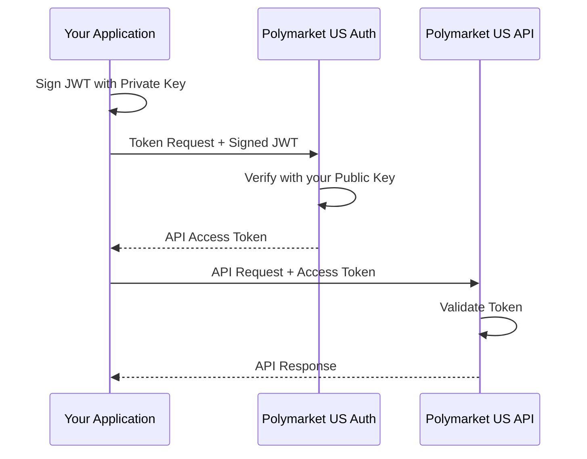

> ## Documentation Index
> Fetch the complete documentation index at: https://docs.polymarket.us/llms.txt
> Use this file to discover all available pages before exploring further.

# Registration

> Setting up Private Key JWT authentication to access the API

The Polymarket Exchange API uses **Private Key JWT** authentication with RSA keys. You sign a JWT with your RSA private key and exchange it for an access token.

<Info>
  Complete [Onboarding](/trader-guide/onboarding) first to generate your keys and receive your Client ID.
</Info>

## Environments

| Environment    | Auth Domain                | API Domain                           |
| -------------- | -------------------------- | ------------------------------------ |
| Development    | `pmx-dev01.us.auth0.com`   | `api.dev01.polymarketexchange.com`   |
| Pre-production | `pmx-preprod.us.auth0.com` | `api.preprod.polymarketexchange.com` |
| Production     | `pmx-prod.us.auth0.com`    | `api.prod.polymarketexchange.com`    |

<Note>
  Use `https://[API Domain]` for both the JWT audience claim and API base URL.
</Note>

<Info>
  Each environment requires separate onboarding. Your pre-production credentials will not work in production.
</Info>

## How It Works



Authentication follows these steps:

1. **Create a signed JWT assertion** - Sign a JWT with your private key
2. **Exchange for API access token** - Send the assertion to the token endpoint
3. **Call API with access token** - Include the token in your API requests

## Prerequisites

After completing [Onboarding](/trader-guide/onboarding), you will have:

| You Have         | From Onboarding                                                              |
| ---------------- | ---------------------------------------------------------------------------- |
| Private key file | Generated by you (keep secure!)                                              |
| Client ID        | Provided by Polymarket via `clientid.txt` in your shared Google Drive folder |
| Auth Domain      | See [Environments](/trader-guide/environments)                               |
| API Audience     | See [Environments](/trader-guide/environments)                               |

## Create Client Assertion JWT

Create a JWT with these claims, signed with your private key using RS256:

```json theme={null}
{
  "iss": "YOUR_CLIENT_ID",
  "sub": "YOUR_CLIENT_ID",
  "aud": "https://pmx-preprod.us.auth0.com/oauth/token",
  "iat": 1703270400,
  "exp": 1703270700,
  "jti": "unique-random-uuid"
}
```

| Claim | Description                               |
| ----- | ----------------------------------------- |
| `iss` | Your client ID (issuer)                   |
| `sub` | Your client ID (subject)                  |
| `aud` | Token endpoint URL                        |
| `iat` | Issued at time (Unix timestamp)           |
| `exp` | Expiration time (max 5 minutes from iat)  |
| `jti` | Unique token ID (prevents replay attacks) |

## Request Access Token

```bash theme={null}
curl --request POST \
  --url "https://pmx-preprod.us.auth0.com/oauth/token" \
  --header "content-type: application/json" \
  --data '{
    "client_id": "YOUR_CLIENT_ID",
    "client_assertion_type": "urn:ietf:params:oauth:client-assertion-type:jwt-bearer",
    "client_assertion": "YOUR_SIGNED_JWT_ASSERTION",
    "audience": "https://api.preprod.polymarketexchange.com",
    "grant_type": "client_credentials"
  }'
```

### Token Response

```json theme={null}
{
  "access_token": "eyJhbGciOiJSUzI1NiIsInR5cCI6IkpXVCIs...",
  "token_type": "Bearer",
  "expires_in": 180
}
```

## Complete Python Example

```python theme={null}
import jwt
import uuid
import time
import requests
from cryptography.hazmat.primitives import serialization

class AuthClient:
    def __init__(self, domain: str, client_id: str, audience: str, private_key_path: str):
        self.domain = domain
        self.client_id = client_id
        self.audience = audience
        self.private_key_path = private_key_path
        self.token = None
        self.token_expiry = None

    def _load_private_key(self):
        """Load the RSA private key from file."""
        with open(self.private_key_path, 'rb') as f:
            return serialization.load_pem_private_key(f.read(), password=None)

    def _create_client_assertion(self) -> str:
        """Create a signed JWT for client authentication."""
        private_key = self._load_private_key()
        now = int(time.time())

        claims = {
            "iss": self.client_id,
            "sub": self.client_id,
            "aud": f"https://{self.domain}/oauth/token",
            "iat": now,
            "exp": now + 300,  # 5 minutes
            "jti": str(uuid.uuid4()),
        }

        return jwt.encode(claims, private_key, algorithm="RS256")

    def get_token(self) -> str:
        """Get a valid access token, refreshing if necessary."""
        if self._is_token_valid():
            return self.token

        # Create client assertion
        assertion = self._create_client_assertion()

        # Request access token
        response = requests.post(
            f"https://{self.domain}/oauth/token",
            json={
                "client_id": self.client_id,
                "client_assertion_type": "urn:ietf:params:oauth:client-assertion-type:jwt-bearer",
                "client_assertion": assertion,
                "audience": self.audience,
                "grant_type": "client_credentials"
            },
            headers={"content-type": "application/json"}
        )
        response.raise_for_status()

        data = response.json()
        self.token = data["access_token"]
        # Set expiry with 30-second buffer
        self.token_expiry = time.time() + data["expires_in"] - 30

        return self.token

    def _is_token_valid(self) -> bool:
        """Check if current token is still valid."""
        if not self.token or not self.token_expiry:
            return False
        return time.time() < self.token_expiry


# Usage
auth_client = AuthClient(
    domain="pmx-preprod.us.auth0.com",
    client_id="YOUR_CLIENT_ID",
    audience="https://api.preprod.polymarketexchange.com",
    private_key_path="/path/to/my_private_key.pem"
)

token = auth_client.get_token()
```

**Required packages:**

```bash theme={null}
pip install PyJWT cryptography requests
```

## Complete Go Example

```go theme={null}
package main

import (
    "crypto/rsa"
    "crypto/x509"
    "encoding/json"
    "encoding/pem"
    "fmt"
    "net/http"
    "os"
    "time"

    "github.com/golang-jwt/jwt/v5"
    "github.com/google/uuid"
)

func getAccessToken(domain, clientID, audience, privateKeyPath string) (string, error) {
    // Load private key
    keyData, err := os.ReadFile(privateKeyPath)
    if err != nil {
        return "", fmt.Errorf("read key file: %w", err)
    }

    block, _ := pem.Decode(keyData)
    privateKey, err := x509.ParsePKCS1PrivateKey(block.Bytes)
    if err != nil {
        return "", fmt.Errorf("parse private key: %w", err)
    }

    // Create client assertion JWT
    now := time.Now()
    claims := jwt.MapClaims{
        "iss": clientID,
        "sub": clientID,
        "aud": fmt.Sprintf("https://%s/oauth/token", domain),
        "iat": now.Unix(),
        "exp": now.Add(5 * time.Minute).Unix(),
        "jti": uuid.New().String(),
    }

    token := jwt.NewWithClaims(jwt.SigningMethodRS256, claims)
    assertion, err := token.SignedString(privateKey)
    if err != nil {
        return "", fmt.Errorf("sign assertion: %w", err)
    }

    // Request access token
    // (implement HTTP POST to token endpoint)
    // ...

    return accessToken, nil
}
```

## Using the Access Token

Include the access token in the `Authorization` header for all API requests. For account-scoped endpoints (trading, positions, reports), you must also include the `x-participant-id` header.

### REST API

```bash theme={null}
curl -X GET "https://api.preprod.polymarketexchange.com/v1/whoami" \
  -H "Authorization: Bearer YOUR_ACCESS_TOKEN" \
  -H "x-participant-id: firms/YourFirm/users/your-user"
```

### gRPC

```python theme={null}
import grpc

# Create metadata with token
metadata = [
    ('authorization', f'Bearer {access_token}'),
    ('x-participant-id', 'firms/YourFirm/users/your-user')
]

# Make gRPC call with metadata
response = stub.SomeMethod(request, metadata=metadata)
```

<Note>
  Verify your token scopes and ensure `x-participant-id` is included for account-scoped endpoints. If you don't know your participant ID, call `GET /v1/whoami` or `GET /v1/users` and put your firm and user into the firms/`<YOURFIRM>`/users/`<USER>` format. Note you will have one firm but can have multiple users.
</Note>

## Key Rotation

You can rotate your keys at any time:

1. Generate a new key pair
2. Complete a new [Onboarding](/trader-guide/onboarding) submission with the new public key
3. We add the new key to your application
4. Update your systems to use the new private key
5. Notify us to remove the old public key

## Troubleshooting

### Common Errors

| Error                      | Cause                             | Solution                                         |
| -------------------------- | --------------------------------- | ------------------------------------------------ |
| `invalid_client`           | JWT signature verification failed | Verify private key matches registered public key |
| `invalid_client_assertion` | Malformed JWT or wrong claims     | Check JWT claims (iss, sub, aud, exp)            |
| `401 Unauthorized`         | Invalid or expired access token   | Request a new access token                       |

### Debugging JWT Claims

If authentication fails, verify your client assertion JWT contains correct claims:

```json theme={null}
{
  "iss": "YOUR_CLIENT_ID",
  "sub": "YOUR_CLIENT_ID",
  "aud": "https://pmx-preprod.us.auth0.com/oauth/token",
  "iat": 1703270400,
  "exp": 1703270700,
  "jti": "550e8400-e29b-41d4-a716-446655440000"
}
```

Common mistakes:

* Wrong `aud` (must be the token endpoint, not the API)
* Expired JWT (exp in the past)
* Reused `jti` (must be unique per request)

***

## API Scopes

Your application is granted specific **scopes** that control which API endpoints you can access. Scopes are included in your access token and validated by the API.

### Available Scopes

| Scope               | Description                                                                                                                                        |
| ------------------- | -------------------------------------------------------------------------------------------------------------------------------------------------- |
| `read:marketdata`   | BBO (best bid/offer) and market data subscriptions (including `BiDirectionalStreamMarketData`)                                                     |
| `read:l2marketdata` | L2 orderbook depth (premium)                                                                                                                       |
| `read:instruments`  | RefData, instrument listings and metadata                                                                                                          |
| `read:orders`       | View open orders, preview orders, order subscriptions                                                                                              |
| `write:orders`      | Insert / cancel / replace / modify orders                                                                                                          |
| `read:reports`      | Search/download orders, trades, executions, and incentives earnings                                                                                |
| `read:positions`    | Position queries, balance queries, position ledger, balance ledger, and position valuations (including historical via `as_of_time` / `as_of_date`) |
| `read:dropcopy`     | Drop copy subscriptions                                                                                                                            |
| `read:accounts`     | View users (`/v1/whoami`, `/v1/users`) and account info                                                                                            |
| `read:funding`      | View funding sources and transactions                                                                                                              |
| `write:funding`     | Update funding, create deposits and withdrawals                                                                                                    |

<Note>
  **Strict scope enforcement.** Calls that are missing a required scope fail with `403 Forbidden` (REST) / `PERMISSION_DENIED` (gRPC) and the message `permission denied: missing required scope <scope>`. Balance ledger endpoints use `read:positions` (not `read:funding`) to stay consistent with the existing balance-query endpoints (`GetAccountBalance`, `ListAccountBalances`).
</Note>

### Scope Requirements by Endpoint

| Endpoint                                     | Method | Required Scope                                     |
| -------------------------------------------- | ------ | -------------------------------------------------- |
| `/v1/trading/orders`                         | POST   | `write:orders`                                     |
| `/v1/trading/orders/cancel`                  | POST   | `write:orders`                                     |
| `/v1/trading/orders/open`                    | GET    | `read:orders`                                      |
| `/v1/report/orders/search`                   | POST   | `read:reports`                                     |
| `/v1/report/trades/search`                   | POST   | `read:reports`                                     |
| `/v1/incentives/earnings`                    | GET    | `read:reports`  <sup>*(disabled in preprod)*</sup> |
| `/v1/positions`                              | GET    | `read:positions`                                   |
| `/v1/positions/balance`                      | POST   | `read:positions`                                   |
| `/v1/positions/balances`                     | POST   | `read:positions`                                   |
| `/v1/positions/ledger`                       | GET    | `read:positions`                                   |
| `/v1/positions/ledger/download`              | GET    | `read:positions`                                   |
| `/v1/funding/balance-ledger`                 | GET    | `read:positions`                                   |
| `/v1/funding/balance-ledger/download`        | GET    | `read:positions`                                   |
| `CreateBalanceLedgerSubscription` (gRPC)     | —      | `read:positions`                                   |
| `/v1/valuations/positions`                   | GET    | `read:positions`                                   |
| `/v1/valuations/positions/download`          | GET    | `read:positions`                                   |
| `/v1/valuations/accounts/statement/download` | POST   | `read:positions`                                   |
| `/v1/orderbook/{symbol}`                     | GET    | `read:l2marketdata`                                |
| `/v1/orderbook/{symbol}/bbo`                 | GET    | `read:marketdata`                                  |
| `BiDirectionalStreamMarketData` (gRPC)       | —      | `read:marketdata`                                  |
| `CreateMarketDataSubscription` (gRPC)        | —      | `read:marketdata`                                  |
| `/v1/refdata/symbols`                        | POST   | `read:instruments`                                 |
| `/v1/refdata/instruments`                    | POST   | `read:instruments`                                 |
| `/v1/refdata/metadata`                       | POST   | `read:instruments`                                 |
| `/v1/whoami`                                 | GET    | `read:accounts`                                    |
| `/v1/users`                                  | GET    | `read:accounts`                                    |
| `/v1/funding/accounts`                       | GET    | `read:funding`                                     |
| `/v1/aeropay/deposits`                       | POST   | `write:funding`                                    |
| `/v1/checkout/deposits`                      | POST   | `write:funding`                                    |
| `/v1/health`                                 | GET    | *(no auth required)*                               |

<Note>
  **gRPC streams (`BiDirectionalStreamMarketData`, `CreateMarketDataSubscription`, `CreateBalanceLedgerSubscription`) run on a separate ALB** (`grpc-api.{env}.polymarketexchange.com:443`) that bypasses the API Gateway and its 30-second idle timeout. Scope validation for these streams happens at the application layer rather than at the load balancer, but the resulting `PERMISSION_DENIED` behavior is identical to REST endpoints.
</Note>

<Warning>
  **`/v1/incentives/earnings` is currently disabled in `preprod`** and returns a route-not-found error there. The endpoint is live in `dev01` and `prod`. Earnings flow shape can still be validated against the [OpenAPI schema](/institutional/oapi-schemas/incentives-schema.json) and the [incentives overview](/institutional/incentives/overview).
</Warning>

### Permission Denied Response

When a request's token is missing the required scope:

```json theme={null}
{
  "code": 7,
  "message": "permission denied: missing required scope read:positions"
}
```

| Surface | Status / Code                  |
| ------- | ------------------------------ |
| REST    | `403 Forbidden`                |
| gRPC    | `PERMISSION_DENIED` (code `7`) |

If you receive this error, update your Auth0 application to include the missing scope and request a fresh access token.

### Checking Your Scopes

Your granted scopes are included in your access token. You can decode the token to see them:

```python theme={null}
import base64
import json

# Decode the payload (middle part of JWT)
payload = access_token.split('.')[1]
payload += '=' * (4 - len(payload) % 4)  # Add padding
claims = json.loads(base64.urlsafe_b64decode(payload))

print("Granted scopes:", claims.get("scope", ""))
```

<Info>
  If you receive a `403 Forbidden` error, check that your application has been granted the required scope for that endpoint. Contact support to request additional scopes.
</Info>

***

## Additional Resources

For more details on Private Key JWT authentication:

* [Private Key JWT Client Authentication](https://auth0.com/docs/get-started/authentication-and-authorization-flow/authenticate-with-private-key-jwt)
* [Machine-to-Machine Applications](https://auth0.com/docs/get-started/applications/application-types#machine-to-machine-applications)
* [RFC 7523 - JWT Profile for Client Authentication](https://datatracker.ietf.org/doc/html/rfc7523)
