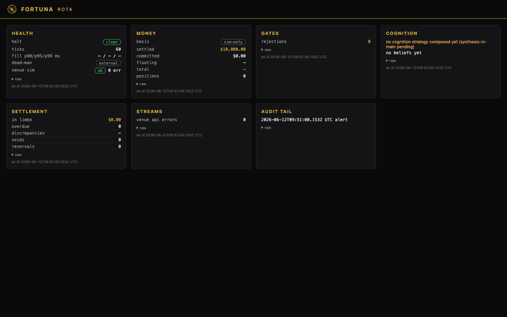
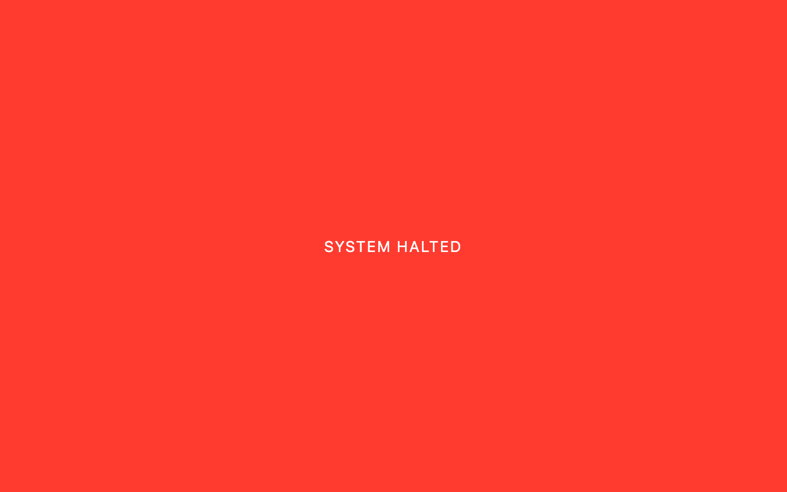

# FORTUNA operations — the daily-operator manual

**Who this is for:** the operator running the FORTUNA daemon day to day —
starting and stopping it, reading ROTA, executing the I2 halt/re-arm path, and
keeping the soak-watch rhythm. Read it before your first `fortuna start`, and
keep it open during the soak.

**As of:** 2026-06-13, branch `main`. The
authoritative design documents are
[docs/design/fortuna-cli.md](design/fortuna-cli.md) (CLI, amendments A1–A10
binding) and [docs/design/rota-dashboard.md](design/rota-dashboard.md) (ROTA,
amendments R1–R12 binding). This manual documents what is **built and
verified**; where the design and the code diverge, the code is cited and wins.
Procedures (halt drill, kill-switch drill, soak start, troubleshooting) live in
`docs/runbooks/`; this manual links them rather than duplicating them.

Related: [README.md](../README.md) · [docs/quickstart.md](quickstart.md) ·
[docs/architecture.md](architecture.md) ·
[FINAL_REPORT.md §5–6](../FINAL_REPORT.md) (soak + go-live runbooks) ·
[docs/reviews/soak-go-gate-2026-06-12.md](reviews/soak-go-gate-2026-06-12.md)
(the SOAK GO verdict and watch metrics).

---

## 1. The `fortuna` CLI, as built

Source: [crates/fortuna-cli/src/main.rs](../crates/fortuna-cli/src/main.rs)
(single binary, hand-rolled arg parsing — house style, no clap; design
[fortuna-cli.md §1.5](design/fortuna-cli.md)). Build it with the rest of the
release set:

```
cargo build --release -p fortuna-cli -p fortuna-live -p fortuna-recorder -p fortuna-killswitch
```

which produces `target/release/fortuna` (the CLI), `fortuna-live` (the
daemon), `fortuna-recorder`, and `fortuna-killswitch`
([FINAL_REPORT.md §5 Step 0](../FINAL_REPORT.md)). All examples below run from
the repo root.

### 1.1 Shared mechanics (read once)

- **Exit codes.** Every command exits `0` on success and `1` on any error,
  with the error printed to stderr as `fortuna: <cause>` (`main()` —
  main.rs:58-66). There are no other exit codes.
- **Config path.** Default `config/fortuna.toml`; every command accepts
  `--config-path <p>` (main.rs:51, 191-195). The committed shape is
  [config/fortuna.example.toml](../config/fortuna.example.toml); the real file
  is operator-local and gitignored.
- **Runtime dir.** Pidfiles and redirected logs live under
  `data/runtime/` (pinned by design amendment A5 — survives reboots, unlike
  `/tmp` on macOS), anchored to the **repo root derived from the config
  path**, never the invoker's cwd (main.rs:165-187). The env var
  `FORTUNA_RUNTIME_DIR` overrides it.
- **Database.** Only `halt` and `rearm` *require* `DATABASE_URL`
  (main.rs:1034-1037). `status`, `start`, and `stop` use it when present and
  degrade honestly when absent or unreachable, bounded at 5 s
  (`STATUS_DB_TIMEOUT_SECS`, main.rs:56) so a Postgres outage can never stall
  an operator command. Note: the CLI's DB sections connect via
  `fortuna_ledger::connect`, which **auto-migrates** the schema
  ([fortuna-cli.md A6](design/fortuna-cli.md)) — point `DATABASE_URL` only at
  the FORTUNA database.
- **Pidfile distrust.** Pidfiles store `<pid>\n<binary-name>`; every read
  re-validates the pid against `ps` *and* requires the live process's command
  to contain the claimed name (macOS PID reuse, amendment A3; `comm_of` +
  `classify_existing`, main.rs:210-320). Every distrust path — dead pid, name
  mismatch, unparseable content — reads as **stopped**, never as a live
  process to signal. Zombies read as not running (main.rs:209, 225).
- **Binary resolution.** Component binaries resolve via `FORTUNA_BIN_DIR`
  first, then siblings of the `fortuna` executable, then `PATH`
  (main.rs:389-405).

### 1.2 `fortuna status`

```
fortuna status [--config-path <path>]
```

Three sections, in order (`status_cmd`, main.rs:902-940):

1. **Processes** — always prints, one line per managed component (`daemon`,
   `recorder`): `running (pid N)`, `stopping since <ISO8601> (pid N)` (the A7
   stop marker), or `stopped (...)` with the stale-pidfile reason spelled out.
2. **Config on disk** — one line, `venue=<v>` (+ `mode=` once config grows
   one), read raw from `[daemon]` with the explicit caveat *"daemon may differ
   until restart"* (amendment A6; `config_on_disk`, main.rs:880-895).
3. **DB section** — only when `DATABASE_URL` is set and Postgres answers
   within 5 s: active halts (or `halts: none`), the 3 most recent `halt`,
   `gate_decision`, and `order` audit rows, and the **age of the most recent
   audit row of any kind** (`status_db_section`, main.rs:962-998).

The DB section is **optional by design**: without `DATABASE_URL` the command
prints `db: DATABASE_URL not set — halts/audit sections skipped` and exits
`0` (amendment A9 pins exit 0); an unreachable Postgres prints
`db: unavailable — ...` and still exits `0`. Nothing about the database can
hide process health.

**The crash tell** (amendment A8): a *stale* most-recent-audit-row age next to
a *live* daemon pidfile means the daemon stopped writing — investigate before
trusting anything above it (main.rs:990-996).

Example (captured 2026-06-12 against this commit, no daemon running, no
`DATABASE_URL`):

```
$ ./target/release/fortuna status --config-path config/fortuna.example.toml
processes:
  daemon: stopped
  recorder: stopped
config on disk: venue=sim (daemon may differ until restart)
db: DATABASE_URL not set — halts/audit sections skipped
```

### 1.3 `fortuna start`

```
fortuna start [--foreground] [--config-path <path>]
```

Managed start of both components, detached (own process group, stdin null,
stdout/stderr append-redirected to `data/runtime/logs/<component>.log` —
amendment A4: append mode, never truncate, so crash backtraces survive
restarts). Sequence (`start_cmd`, main.rs:470-596):

1. **Config check first** — `FortunaConfig::load_file`; failure refuses the
   start, exit 1.
2. **Already running?** Idempotent: components with a validated live pidfile
   print `already running (pid N)`; if nothing needs starting the command
   prints `already running — nothing to start` and exits 0. Stale pidfiles
   are removed and reclaimed; an **empty** pidfile means another `start` is
   mid-claim — refusal, never a steal (main.rs:496-512).
3. **Unmanaged-recorder refusal** (amendment A2): `start` checks
   `pgrep -f fortuna-recorder` for any recorder process *not* accounted for
   by the managed pidfile and **refuses the whole start** (even the
   daemon half) if one exists — two appenders can tear JSONL lines in the B0
   dataset. The refusal text carries the one-time migration: stop the manual
   recorder, re-run `fortuna start` (main.rs:521-535). `pgrep` failing to run
   is itself a refusal — fail closed (main.rs:450-462).
4. **Claim-then-spawn**: the pidfile is claimed atomically (`O_EXCL`) *before*
   the process exists; on spawn failure the claim is released
   (main.rs:324-384). The daemon runs `fortuna-live <config>`; the recorder
   runs the pinned live invocation `--interval-secs 30 --bracket-series
   KXBTC15M,KXBTC,KXBTCD --out-dir <abs>/data/perishable` (overridable via an
   optional `[recorder]` config table; the out-dir is forced absolute and
   anchored to the config-derived repo root — main.rs:410-446). Spawn cwd is
   pinned to the repo root (main.rs:554-556).
5. **Best-effort DB tail** (amendments A8 + A10): with `DATABASE_URL` set,
   `start` prints any **active halts** (`ACTIVE HALTS (n) — the daemon will
   not trade until re-armed`) and writes an advisory `lifecycle` audit row
   (actor `$USER`, the started pids). Bounded at 5 s; a dead DB warns and
   never blocks the start — the daemon's own boot audit row is the I5 record
   (main.rs:567-594).

`--foreground` is the debugging mode: it `exec`s `fortuna-live <config>` in
place — the daemon owns the terminal; no pidfile, no recorder, no detach
(main.rs:476-484).

Example (the manual smoke recorded in
[fortuna-cli.md §13](design/fortuna-cli.md)):

```
$ FORTUNA_BIN_DIR=target/release ./target/release/fortuna start
started daemon (pid 81234)
started recorder (pid 81237)
active halts: none
```

### 1.4 `fortuna stop`

```
fortuna stop [--timeout-secs N] [--config-path <path>]
```

Graceful shutdown: SIGTERM the daemon, then the recorder; default timeout 60 s
per component (`stop_cmd`, main.rs:676-807). The safety semantics are the
point:

- **`stop` never sends SIGKILL.** SIGTERM goes out via a `kill -15` shell-out;
  std's `Child::kill` is SIGKILL and is never used (main.rs:640-649; the
  shell-out is a recorded GAPS entry per design checklist item 8). The daemon's
  SIGTERM path is *cancelling working orders and writing the final audit row*
  — killing it harder forfeits exactly that.
- **Process exit alone is not success** (amendment A1). For the daemon, `stop`
  records the log offset *before* signalling and succeeds only when the
  daemon's clean-shutdown marker — `fortuna-live: clean shutdown`
  (crates/fortuna-live/src/main.rs:284) — appears in the log **after** that
  offset (main.rs:636, 654-667, 756-767). An exit without the marker is
  reported as a crash-style exit and counts as a warning.
- **Timeout leaves everything for you.** On timeout, the process, its pidfile,
  and the `.stopping` marker (which makes `status` read `stopping since T`)
  are left in place, and `stop` **still proceeds to the recorder** (amendment
  A7). The warning text is the procedure: *"daemon is cancelling working
  orders — do NOT kill -9; watch `fortuna logs daemon`; if the venue is
  unreachable use `fortuna kill`"* (main.rs:744-748).
- **Idempotent**: a second `stop` prints `already stopped` per component and
  exits 0. Any warning (timeout, missing shutdown marker, mid-claim pidfile)
  makes the command exit 1 with `stop completed with N warning(s)`
  (main.rs:803-805).
- The `lifecycle` audit row is best-effort and bounded — a dead DB can never
  block a shutdown (amendment A10; main.rs:773-801).

Example (clean path, from the recorded smoke,
[fortuna-cli.md §13](design/fortuna-cli.md)):

```
$ ./target/release/fortuna stop
daemon: stopped (clean shutdown confirmed in the log)
recorder: stopped
```

### 1.5 `fortuna halt`

```
fortuna halt <global|strategy:<id>|venue:<id>> --reason "..." --operator <name>
```

Writes a durable `halt_events` row plus a `halt` audit row (kind, actor =
`--operator`, the scope and reason in the payload) — `db_command`,
main.rs:1061-1073. Requires `DATABASE_URL`; both `--reason` and `--operator`
are mandatory (operator actions are attributed). The running daemon observes
the halt via its halt poll within `[daemon].halt_poll_ms` = 500 ms
([config/fortuna.example.toml:110](../config/fortuna.example.toml)).

```
$ ./target/release/fortuna halt global --reason "drill" --operator xavier
halt set on global; the runner enforces it within its poll interval
```

### 1.6 `fortuna rearm`

```
fortuna rearm <global|strategy:<id>|venue:<id>> --reason "..." --operator <name>
```

**The** I2 human re-arm path — out-of-band by construction, CLI-only by
design: Slack may request, the CLI confirms; a compromised Slack token must
not be able to un-halt a halted system (main.rs:1-5). Writes the durable
re-arm row plus its audit row (main.rs:1074-1086).

**Re-arm is restart-gated.** A running daemon never auto-resumes when the
halt is cleared — the re-arm takes effect at the **next daemon restart**,
whose boot fold reads the set→rearm sequence (asserted by
`a_running_daemon_never_auto_clears_a_halt_on_rearm_only_a_restart_does`;
[FINAL_REPORT.md §5 Step 6](../FINAL_REPORT.md)). The full drill — clear,
restart, verify — is the
[halt-and-rearm runbook](runbooks/halt-and-rearm.md). Do not improvise it.

```
$ ./target/release/fortuna rearm global --reason "drill complete" --operator xavier
re-armed global (operator: xavier)
```

### 1.7 `fortuna kill`

```
fortuna kill [--flatten] [--journal <path>]
```

Triggers the **standalone** I4 kill switch by exec'ing the independent
`fortuna-killswitch` binary — never a library call, and never Postgres: this
command must keep working with the cognition runtime, the event loop, and
Postgres all dead (main.rs:1000-1031; the structural rule is
[fortuna-cli.md §1.2](design/fortuna-cli.md)). Default action is `freeze`;
`--flatten` currently maps to the kill switch's `report` action; the journal
defaults to `/tmp/fortuna-killswitch.jsonl` (main.rs:1003-1007). The
standalone binary's own surface is
`fortuna-killswitch <freeze|report|self-test> --journal <path>
[--venue kalshi]` (crates/fortuna-killswitch/src/main.rs:1-11); `self-test`
is the monthly-drill path — see the
[kill-switch drill runbook](runbooks/kill-switch-drill.md). When the installed
binary is absent the CLI falls back to `cargo run -p fortuna-killswitch`
(main.rs:1012-1026). Exit 1 if the switch exits non-zero.

### 1.8 `fortuna logs`

```
fortuna logs <daemon|recorder> [-f]
```

Tails the `start`-redirected log (`data/runtime/logs/<component>.log`) via
`exec tail -n50 [-f]` — Ctrl-C lands on `tail` directly (main.rs:850-875).
`start` owns the redirection (amendment A4 — neither binary has a `--log-file`
flag); if no log file exists yet the command errors with *"has `fortuna start`
run?"*. Unknown components are rejected with the component list.

### 1.9 `fortuna config check`

```
fortuna config check [--config-path <path>]
```

Whole-shape validation via `fortuna_ops::FortunaConfig::load_file` — starts
nothing, mutates nothing (main.rs:832-845). Run it after every config edit,
before `fortuna start`.

```
$ ./target/release/fortuna config check --config-path config/fortuna.example.toml
config OK: config/fortuna.example.toml
```

---

## 2. ROTA — the operator console

ROTA is the read-only gold-on-black instrument console (design
[rota-dashboard.md](design/rota-dashboard.md), amendments R1–R12 binding). The
daemon serves it on the same listener as the metrics endpoint —
`[daemon].metrics_bind = "127.0.0.1:9187"`
([config/fortuna.example.toml:111](../config/fortuna.example.toml);
crates/fortuna-live/src/main.rs:113-143):

```
open http://127.0.0.1:9187/rota
```

For a STANDALONE bringup without the daemon — seeded local data, used to verify
or screenshot the boards in isolation — see
[runbooks/rota-local-bringup.md](runbooks/rota-local-bringup.md)
(`cargo run -p fortuna-ops --example rota_local`, serves `:8799`).

The legacy T1.5 instrument routes (`/`, `/metrics`, `/api/boards`) remain
alongside it (design §0.1 + slice 3 note). **Every ROTA route is GET-only by
construction**; the route-table test pins 405 on every mutating method, and
there is no write/control plane, ever (I2/I4; design §7).

The screenshots below are the real R12 verification-gate captures
(desktop 1440 px, seeded Sim run), archived under `docs/reviews/rota-visual/`:



### 2.1 Honest-state conventions (read these first)

ROTA's contract is that **nothing on the screen is ever faked** — the
vacuous-data lesson is baked into every panel:

- **Nulls render as `—`, never as zero.** A `—` means "no source for this
  value yet", not "zero" (shell `fmtCents`/`??` rendering,
  crates/fortuna-ops/src/rota.rs:505-553; e.g. fill latencies are null until a
  fill is observed — crates/fortuna-live/src/views.rs:59-63).
- **Absent capabilities degrade explicitly, HTTP 200, never 500** (amendment
  R1). An unpopulated view renders an amber warning (`view "x" not yet
  populated...`); a missing Postgres capability renders
  `available: false` sub-surfaces (rota.rs:75-88, 124-126).
- **`sim-only` label on Money** (amendment R6): the account block's basis is
  pinned to what the Sim venue actually exposes; the label exists so you never
  read it as the complete live picture (views.rs:142-154).
- **"as of `<timestamp>` UTC"** under every panel is the snapshot's
  `generated_at` — the daemon's last clock read, not the browser's
  (rota.rs:510). All times on the console are labeled UTC (R6).
- **The raw-JSON expander** (`raw` ▸) on every panel shows the verbatim view
  payload — the formatted rendering never hides data (rota.rs:509).
- **Red `#FF3B30` is reserved exclusively** for halt/breach — no decorative
  red anywhere (design §2).

### 2.2 Panel-by-panel

Data plane: the daemon shapes each view's JSON per tick (`views_from`,
[crates/fortuna-live/src/views.rs](../crates/fortuna-live/src/views.rs) — pure
read over runner accessors, R2) into `DashboardSnapshot.views`; the handlers
in [crates/fortuna-ops/src/rota.rs](../crates/fortuna-ops/src/rota.rs) serve
that verbatim plus their own ledger queries over a **dedicated read-only
2-connection pool** (3 s statement timeout) — never the audit writer's pool,
because audit-append failure is a global halt and dashboard load must be
unable to queue against it (amendment R5;
`fortuna_ledger::connect_readonly_pool`, wired at
crates/fortuna-live/src/main.rs:125).

**Health** (poll 2 s) — `/api/rota/v1/health`
- `halt` pill: `clear` (green) or `HALTED` (red) + reason — from
  `SimRunner::active_halt()` (views.rs:65-67). This same field drives the
  takeover (below).
- `ticks`: runner tick counter.
- `fill p90/p95/p99 ms`: fill-latency quantiles; **no p50 exists or gets
  added** (R6); `—` until fills are observed (views.rs:59-63, 125-127).
- `dead-man`: shows the `external` pill because
  `dead_man_last_ping_age_secs` is null **by design** — the pinger is an
  independent task with no shared read seam; defer to your external monitor's
  own page (design §5 dead-man reconciliation note; views.rs:128).
- `venue sim`: ok/errors pill + API error count (views.rs:129-133).

**Money** (poll 5 s) — `/api/rota/v1/money`
- `basis: sim-only` (R6 label).
- `settled` = Sim cash, `committed` = reserved — both real, from the boards
  `account` block (`SimVenue::inspect_totals`, design slice 7).
- `floating` and `total` are `—` (null): the money identity is
  `total = settled + floating` (R6) and floating's only source is the mark
  loop, which is not yet exposed — honestly null, never fabricated
  (views.rs:94-115, 142-154).
- `positions`: count + first rows as `market yN/nN $pnl`.

**Gates** (poll 5 s) — `/api/rota/v1/gates`
- `rejections`: total gate rejections (runner counter, views.rs:157).
- Per-check breakdown `{check, count, number}` — check name from
  `SimRunner::rejections_by_check()`, `number` = the 1-based spec-5.3
  pipeline position recovered via `GateCheck::index()`
  (views.rs:75-92; crates/fortuna-gates/src/pipeline.rs:76-89). The by-check
  counts sum to the total (design slice 6 invariant).

**Cognition** (poll 10 s) — `/api/rota/v1/cognition`
- Counters/budgets ride the daemon-shaped view and stay **absent until a
  cognition strategy is composed** — rendered as an explicit
  `counters_status: unavailable` warning, never fabricated zeros that would
  read "all clear" (rota.rs:128-153).
- `recent_beliefs`: the 20 newest beliefs, click-to-expand rows showing each
  belief's persisted `evidence` and `provenance` JSONB (operator amendment,
  design §5); evidence is truncated at 4 KB per row with an explicit
  `truncated: true` + total byte count — the ledger row stays whole
  (rota.rs:106-121, 160-185).
- `calibration_scopes`: DISTINCT scopes at max version
  (`CalibrationParamsRepo::scopes`, R7). Both are ROTA's own queries over the
  R5 pool, each degrading independently.

**Settlement** (poll 10 s) — `/api/rota/v1/settlement`
- `in limbo` (cents), `overdue`, `voids`, `reversals` — from the daemon view
  (views.rs:135-141; the boards' `-1` "none pending" sentinel is normalized
  to zero capital in limbo, views.rs:70-73).
- `discrepancies` renders `—`: `discrepancies_open` is not yet shaped into
  the daemon view (views.rs populates limbo/overdue/voids/reversals only) —
  a null, not a zero.

**Streams** (poll 15 s) — `/api/rota/v1/streams`
- `venue api errors`: global counter (R6 flattening; views.rs:162).
- `rec <stream>` rows: the recorder liveness scan of
  `data/perishable/<today>/*.jsonl` — **file metadata only** (mtime → age,
  size; never content, since a line-count of a multi-GB stream on a 15 s poll
  would be a self-inflicted DoS). `healthy = age < 120 s` (two missed 30 s
  recorder cycles); rendered as a `live`/`stale` pill + age
  (`scan_recorder`, rota.rs:219-283). Rows appear only when the daemon holds
  the `perishable_dir` capability and today's directory exists.
- WS `ws_gap_count`/`resync_count` are documented stub `0` until T4.2 ships
  the dial (views.rs:166-170) — visible in the raw expander.

**Audit tail** (poll 2 s) — `/api/rota/v1/audit`
- A **lossless cursor-polled** JSON endpoint, not SSE (amendment R3 — lossy
  drop-oldest is off-brand for an I5 audit surface):
  `GET /api/rota/v1/audit?after=<audit_id>&limit=100`. Cursorless requests
  return the *newest* page re-sorted ascending — the tail, not the head (the
  2026-06-11 gate F1 fix; rota.rs:317-364) — and the shell polls cursorless
  every 2 seconds, rendering the last 12 rows as `at UTC kind · actor`
  (rota.rs:551-561). Limit clamps to [1, 500].

### 2.3 The halt takeover

When `health.halt_active` is true, the shell displays a full-screen red
takeover — you cannot miss a halted system:



The overlay is driven by the same 2 s health poll (rota.rs:486-490, 557).
When you see it: `fortuna status` for the scope and reason, then the
[halt-and-rearm runbook](runbooks/halt-and-rearm.md). A halt is I2 territory —
it never clears itself, and re-arm is restart-gated (§1.6).

---

## 3. The operator's rhythm

The Phase-4 EXIT soak (a continuous week green on the Sim venue) is cleared
to start by the [soak-go gate verdict](reviews/soak-go-gate-2026-06-12.md)
(ACCEPT, SOAK: GO) but has NOT been started — starting it is an operator
action ([runbooks/soak-start.md](runbooks/soak-start.md), the living
procedure; FINAL_REPORT §5 is the acceptance-time record).
The ten soak-watch metrics below are that verdict's §SOAK-WATCH METRICS;
firings are logged to `docs/reviews/soak-log.md` (created with the first
entry).

### 3.1 Morning and evening (daily, during the soak)

1. **`fortuna status`** — both components `running`, no active halts, and a
   *fresh* most-recent-audit-row age (a stale age beside a live daemon
   pidfile is the crash tell, §1.2).
2. **ROTA glance** (`http://127.0.0.1:9187/rota`) — halt pill clear; Money
   settled/committed plausible; Gates rejections explained; Settlement
   overdue/voids/reversals zero or accounted for; Streams recorder rows
   `live`; Audit tail moving. [soak-watch 2, 5, 10]
3. **Slack `#fortuna-digest`** — the daily digest fires at the 00:00 UTC day
   boundary (the first fires on boot; asserted in
   `daemon_smoke_boot_ticks_signal_shutdown`,
   crates/fortuna-live/tests/daemon_smoke.rs:202-211). Every outbound Slack
   message is also an audit row, with or without a reachable Slack router
   (soak-go gate §B2).
4. **The journal row** — exactly one daily-reconciliation journal row per UTC
   day (Postgres-idempotent via the unique day index; soak-go gate §B1).
   Reconciliation *skip*/*failure* audit rows are the honest-degrade signal
   when the mind is unkeyed or Postgres blips. [soak-watch 6]
5. **Dead-man freshness** — the daemon pings `FORTUNA_DEADMAN_URL` every 60 s
   (`[deadman].ping_interval_secs`,
   [config/fortuna.example.toml:104-105](../config/fortuna.example.toml));
   check your external monitor, not ROTA (the Health panel defers to it,
   §2.2). [soak-watch 4]
6. **Mind budget burn** vs `[cognition]` daily/per-cycle budgets — degrade
   alerts land in `#fortuna-ops`. [soak-watch 3]
7. **Metrics endpoint** reachable:
   ```
   curl -s http://127.0.0.1:9187/metrics | head -5
   ```
   plus absence of halt-poll-failure alerts. [soak-watch 10]

Restart re-fires of the weekly/monthly reviews are **expected, not
anomalies** — the schedulers are in-memory and fire on boot; only the daily
reconciliation is Postgres-idempotent ([FINAL_REPORT.md §5 Step
4](../FINAL_REPORT.md); soak-go gate Info finding). Note each restart in the
soak log. [soak-watch 1]

### 3.2 Weekly

- **The weekly-review digest**: one `weekly_review` audit row plus a summary
  in `#fortuna-digest` per Monday-aligned week (boot fire on day one, then
  2026-06-15, -22, -29 for a soak started at the verdict). Lesson candidates
  route to `#fortuna-review`; review failures to `#fortuna-ops` (soak-go gate
  §B2). [soak-watch 7] The review emits GO/NO-GO **recommendations only** —
  promotion is yours (I7; `[review]` thresholds,
  [config/fortuna.example.toml:58-61](../config/fortuna.example.toml)).
- Skim the week's Slack send-failure markers (`[SLACK SEND FAILED:` audit
  rows) and the shutdown summary row if you restarted. [soak-watch 9]

### 3.3 Monthly

- **Kill-switch drill** — `scripts/killswitch-test.sh` with the main runtime
  down (Postgres optionally stopped); monthly, and always before the first
  live order ([FINAL_REPORT.md §6 Step 5 and "Operational
  pins"](../FINAL_REPORT.md)). Procedure:
  [kill-switch drill runbook](runbooks/kill-switch-drill.md).
- **`monthly_review` audit row** at the calendar-month boundary (plus the
  boot fire): allocation recommendations (advisory, never inventing capital)
  and the operator checklist (kill-switch test, backup drill) route to
  `#fortuna-ops` (soak-go gate §B2). [soak-watch 8]
- **Backup restore drill** ([FINAL_REPORT.md §6 Step 0](../FINAL_REPORT.md));
  see the [backup-restore runbook](runbooks/backup-restore.md) for current
  status.

### 3.4 Where every alert lands

Routing is spec Section 8, implemented send-side in
`crates/fortuna-ops/src/slack.rs` (`SlackRouter::route`, slack.rs:185-196);
channel IDs come from env (`FORTUNA_SLACK_CHANNEL_*`, validated at boot —
crates/fortuna-live/src/boot.rs:57-61). Every outbound message also writes an
audit row, and send failures are themselves audited (soak-go gate §B2).

| Kind | Channel (env var) | What flows there |
|---|---|---|
| `Trading` | `FORTUNA_SLACK_CHANNEL_TRADING` | fills, position opens/closes, per-trade one-liners (slack.rs:24-25) |
| `Alert` | `FORTUNA_SLACK_CHANNEL_ALERTS` | halts, drawdown approaches, divergence, outages, disputes (slack.rs:26-27) |
| `Review` | `FORTUNA_SLACK_CHANNEL_REVIEW` | interactive items requiring a human — e.g. weekly lesson candidates (slack.rs:28-29; soak-go §B2) |
| `Digest` | `FORTUNA_SLACK_CHANNEL_DIGEST` | daily digest, weekly review summary, monthly review (slack.rs:30-31) |
| `Ops` | `FORTUNA_SLACK_CHANNEL_OPS` | cost tracking, degrade alerts, edge-refresh failures, monthly operator drills, infra (slack.rs:32-33; soak-go §B2) |

Slack is **outbound-only** today: the send-side router is built and audited;
the Socket Mode listener is operator-blocked on Slack app credentials
([FINAL_REPORT.md §4](../FINAL_REPORT.md)). And by design, no Slack message
can ever halt-clear or re-arm anything — that is the CLI's job (§1.6).
